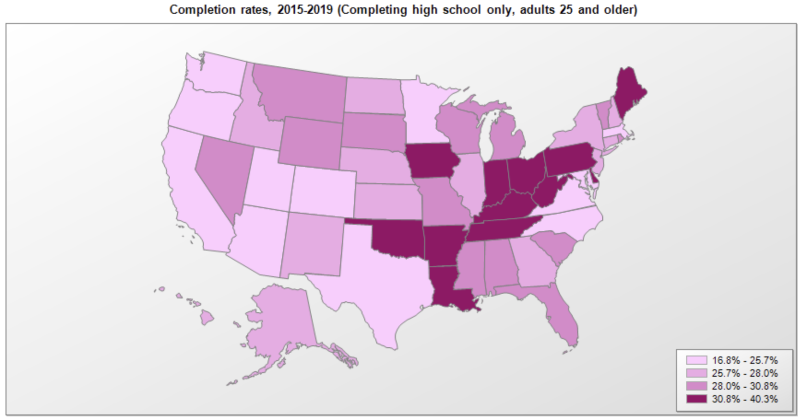
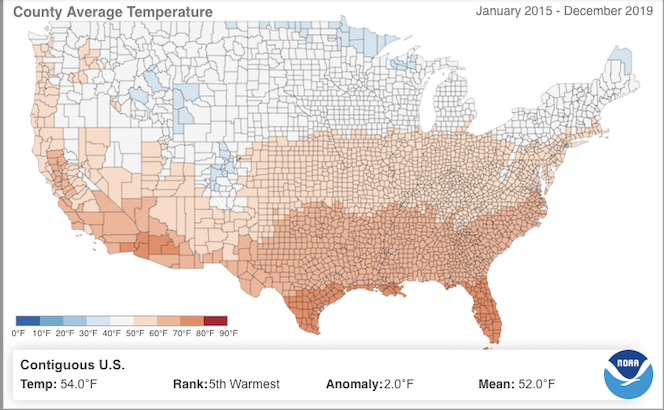
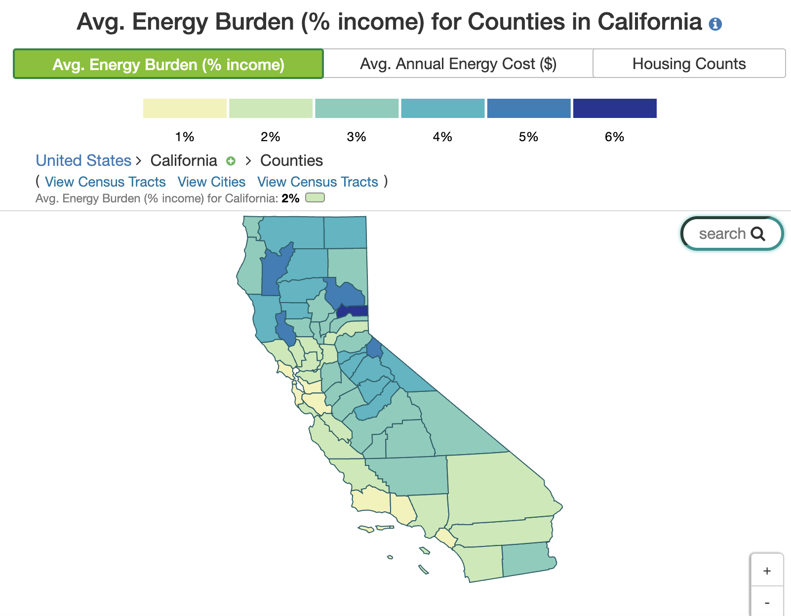

```{r setup, include=FALSE}
knitr::opts_chunk$set(echo = TRUE)
library(tidyverse)
library(here)
library(janitor)
library(xtable)
library(kableExtra)
```


## Introduction

**Premise:** Energy poverty is one of the significant challenges for developing countries of the world with more than a billion people around the world lacking access to simple technologies such as lamps and appliances. The idea that the lack of access to lighting at night or heating/cooling during thermal comfort could impact children and their ability to perform well in school seems apparent. Several studies have concluded households with a low level of educational attainment have more limited access to electricity and other forms of clean energy [Insert Ref]. 
It's evident that there's potential for a vicious cycle where energy poverty is hindering education which in turn decreasing their ability to escape it; ultimate depriving people of a higher quality life. 

**Question:** Do these relationships between energy poverty and education hold true in the United States (the developed country context, based on GDP)? 

**Motivation:** There is a lack of research connecting education and energy poverty in the US. Though electricity access is prevalent in the U.S., the reliance on individually-owned cars for transportation and anticipated increased variability in climate make the U.S. particularly vulnerable. The disparities in energy equity considering income and race across the US are not recognized as a problem at the federal level, therefore limiting the response to this issue unlike the gradual and coordinated response in countries such as the UK [Insert Ref]. 
The goal of this project is to encourage more research through the education-energy poverty nexus lens. 

## Datasets Used
The analysis was conducted on the county level in the US due to the increased sampling power and available data resolution for parameters in question.

**Educational Attainment data** available on the county-level from the USDA Economic Research Service, the most recent data is available for 2015 to 2019
(Link: https://data.ers.usda.gov/reports.aspx?ID=17829 )

**Comprehensive County Indicators data** from County Health Rankings which compiles data from several data sources. The final analysis used the ***math and reading score indicators*** from this dataset that are modelled by Stanford Education Data Archive program based on EDFacts and state sources to achieve comparability across the country. Although the dataset is labelled as 2021 data, the testing score is actually based on 2018. 
(Link: https://www.countyhealthrankings.org/explore-health-rankings/rankings-data-documentation) 

**Temperature data** available on the county-level for the entire US from NOAA National Centers for Environmental Information was downloaded as 60 month average ranging from 2015 to 2019 to align with other datasets. The entire temporal coverage in 1895 to present day. 
(Link: https://www.ncdc.noaa.gov/cag/county/mapping/110/tavg/201501/60/value)


**Low-Income Energy Affordability data** available on county-level from the Department of Energy based on modelling done using the 2016 5-year American Community Survey (ACS5)
(Link: https://www.energy.gov/eere/slsc/low-income-energy-affordability-data-lead-tool)

Limitations of the the datasets used: 

The LEAD energy affordability estimates are centered around housing energy costs. While this is important, an entire dimension of inequity due to energy poverty and mobility is missed out on due to the lack of information on transportation sector. 

With county-level resolution in US being so challenging to achieve, it's important to note that there are several processes of modelling and estimations incorporated into the available datasets for the education data and LEAD tool that must be considered and noted. Biases could arise due to response bias and attrition for the surveys such as the American Community Survey (ACS) that are heavily relied on.

In the case of temperature data, the lost resolution due to the averaging of data over a large spatial unit such as county must be noted as well.  

Nevertheless, this analysis will use the best available data to my knowledge for reasonably overlapping time periods. 


```{r data read, echo=FALSE, results='hide'}
# Read in data
educ_df <- read_csv(here("data", "Education.csv"), skip = 4, show_col_types = FALSE)
county_health <- read_csv(here("data", "analytic_data2021.csv"), skip = 1, show_col_types = FALSE)
temp_avg_df <- read_csv(here("data", "temp", "110-tavg-201912-60.csv"), skip = 3, show_col_types = FALSE)
temp_min_df <- read_csv(here("data", "temp", "110-tmin-201912-60.csv"), skip = 3,show_col_types = FALSE)
temp_max_df <- read_csv(here("data", "temp", "110-tmax-201912-60.csv"), skip = 3,show_col_types = FALSE)
LEAD_df <-
    list.files(path = here("data", "LEAD"), pattern = "*.csv") %>% 
    map_df(~read_csv(here("data", "LEAD",.), skip = 7,show_col_types = FALSE))
```


```{r data wrangling, echo=FALSE}
# Clean temp data to prepare for join
temp_avg_df <- temp_avg_df %>%
               rename(t_avg = Value) %>% 
               select(1:3)
temp_min_df <- temp_min_df %>%
               rename(t_min = Value) %>% 
               select(1:3)
temp_max_df <- temp_max_df %>%
               rename(t_max = Value) %>% 
               select(1:3)
```


```{r, echo=FALSE}
# Join temperature statistics data
join_temp<-temp_avg_df %>% 
  full_join(temp_min_df, by= c("Location ID", "Location")) %>%       
  full_join(temp_max_df, by= c("Location ID", "Location")) %>% 
  separate(`Location ID`, 
                c("State", "FIP-End")) %>% 
  rename("Area name" = Location)
# Clean education data
educ_df <- educ_df %>% 
           drop_na(State, "2003 Urban Influence Code") %>% 
           filter(State != "PR") %>% 
           select(-ends_with(c("1970","1980", "1990", "2000"))) %>% 
           select(-starts_with(c("2003","2013"))) 
# Clean LEAD energy affordability data
LEAD_df <- LEAD_df %>% 
           mutate(`FIPS Code` = (gsub("'", "",(LEAD_df$`Geography ID`)))) %>% 
           subset(select= -c(`Geography ID`))

# Clean county health data to include state, county, test scores and rural pop
county_health <- county_health %>% 
                 select( contains("code")| contains("state") | 
                         contains("county")|contains("v159")
                         |contains("v160")|contains("v058")) 
              
  
```

```{r, echo=FALSE}
# Join LEAD, temp and education data
energy_edu_temp<- join_temp %>% 
                  left_join(educ_df, by= c("State", "Area name")) %>% 
                  full_join(LEAD_df, by= "FIPS Code")%>% 
                  subset(select= -c(`FIP-End`,Name)) %>% 
                  clean_names() %>% 
                  mutate(pct_hs_or_less = percent_of_adults_with_less_than_a_high_school_diploma_2015_19
                         +percent_of_adults_with_a_high_school_diploma_only_2015_19 )

energy_edu_temp <- energy_edu_temp %>% 
                   mutate(comf_diff_temp = (72 - t_avg)) 

all_param <- energy_edu_temp %>% 
             rename(fipscode = fips_code) %>% 
             full_join(county_health, by= "fipscode")
  

```

```{r, echo=FALSE}
# Import built-in state datasets and abbreviations for join
statefacts <- as.data.frame(state.x77)
stateregion <- as.data.frame(state.region)
stateabb <- as.data.frame(state.abb)
statefacts <- statefacts %>% 
  cbind(stateregion) %>% 
  cbind(stateabb) %>% 
  rename(region = state.region) %>% 
  rename(state = state.abb)

energy_edu_temp<- energy_edu_temp %>% 
                  left_join(statefacts, by= "state")

```

## Analysis Plan

There will be two stages to the analysis.

### Part 1
First will be exploring whether there is a correlation between educational attainment and energy burden. 
The [Insert Ref] paper concluded that across several energy poverty and education studies in developing countries that "households with a low level of educational attainment, have restricted access to clean energy forms, such as electricity".
In the developed country context, we will test if a similar relationship exists between educational attainment and energy burden. The assumption is that **energy affordability** is a representative measure of access instead of the binary "access/no access" scenario in developing countries.  

### Part 2
Next we will be exploring whether there is a correlation between energy burden and educational outcomes(measured by standardized math and reading scores).


```{r}
summary(lm(all_param$avg_energy_burden_percent_income ~  all_param$pct_hs_or_less + all_param$v058_rawvalue))
```
```{r}
summary(lm(all_param$v160_rawvalue ~ all_param$avg_energy_burden_percent_income + all_param$comf_diff_temp))
```

```{r}
plot(all_param$v160_rawvalue ~ all_param$avg_energy_burden_percent_income + all_param$comf_diff_temp)

```

